# AgenticForge — Technical Design Document

## Who this is for

This document is written for developers who are new to the project — and
possibly new to agentic AI systems in general. It explains not just *what*
AgenticForge is, but *why* it's built the way it is: the alternatives that
were on the table at each decision point, and the reasoning for the option
that was picked. Diagrams use [Mermaid](https://mermaid.js.org/), which
renders automatically on GitHub and in most IDEs (VS Code, JetBrains) — no
external tool needed to view them.

If a term is unfamiliar, check the [Glossary](#glossary) at the end before
searching elsewhere.

---

## 1. What is AgenticForge?

AgenticForge is an open-source **agentic AI orchestration platform** for
enterprises. In plain terms: it's the infrastructure that lets a company
run AI agents (LLM-driven programs that can call tools, query data, and take
multi-step actions) safely, observably, and against whichever model provider
makes sense — without every team re-solving the same problems of tool
integration, tracing, access control, and cost control from scratch.

It is being built incrementally across eight milestones (**M1–M8**), each one
a working, demoable increment rather than a big-bang release.

### Goals

- Let an agent call **tools** (internal APIs, databases, files) through one
  consistent, standard protocol.
- Support **multiple LLM providers** (OpenAI, Anthropic, Azure OpenAI,
  self-hosted Ollama/vLLM) without rewriting agent code to switch providers.
- Make every agent run **observable** — trace every model call and tool call.
- Support **human-in-the-loop (HITL)** approval for sensitive tool calls.
- Enforce **RBAC, audit logging, and PII handling** as first-class concerns,
  not bolted on at the end.
- Run entirely on a **developer laptop** via Docker Compose, and move to a
  managed cloud (Helm/Terraform on AWS/Azure/OKE/GCP) later **without
  rearchitecting**.

### Non-goals (for Phase 1 / M1–M8)

- A hosted multi-tenant SaaS control plane (this is the self-hosted engine
  it would run on).
- A visual, no-code agent builder UI (out of scope — this is the backend).
- Training or fine-tuning models — AgenticForge only *calls* models.

---

## 2. Design Philosophy: The Decisions Behind the Architecture

Every non-trivial system sits on a "spectrum" of design choices — there is
rarely one objectively correct answer, only trade-offs suited to the
problem at hand. This section walks through the major spectrum points a
junior engineer should understand, what AgenticForge chose, and why.

### 2.1 Service granularity: coarse services, not a microservice-per-domain mesh

| Spectrum | Description |
|---|---|
| One end | A single monolithic process doing everything |
| Other end | A microservice per business capability (agents-service, tools-service, models-service, runs-service, …) |
| **Chosen** | **A handful of coarse-grained services**, split by *runtime concern*, not by business entity |

AgenticForge has exactly four Python services:
`orchestrator-api` (HTTP surface), `orchestrator-worker` (agent execution),
`mcp-server` (tool exposure), and `ingestion` (data pipelines) — plus a
shared library (`packages/shared`) so business entities like `Agent`,
`Tool`, and `Run` aren't duplicated or drift across services.

**Why:** a microservice-per-entity split adds network hops and deployment
complexity that a small team doesn't get value from yet. Splitting by
*runtime concern* instead — synchronous request handling vs. long-running
async execution vs. tool exposure — maps directly to how each part actually
needs to scale and fail independently. This can be split further later if a
specific service becomes a bottleneck; the shared schema makes that a
lower-risk move than it would be with per-service databases.

### 2.2 Synchronous API + asynchronous execution

| Spectrum | Description |
|---|---|
| One end | The API handler runs the whole agent loop and blocks until done |
| Other end | Everything is event-driven with no synchronous surface at all |
| **Chosen** | **`orchestrator-api` returns immediately; `orchestrator-worker` executes off a Redis-backed queue** |

An agent run can take anywhere from seconds to minutes, and can *pause
indefinitely* waiting on a human approval (see 2.7). A request/response HTTP
handler is the wrong shape for that. `POST /runs` writes a `Run` row,
enqueues a job (via [`arq`](https://arq-docs.helpmanual.io/), a Redis job
queue), and returns `202 Accepted` with a `run_id` immediately. The worker
picks the job up, and clients poll or stream (`sse-starlette`) for status.

**Why:** decouples "accepting work" from "doing work." The API stays fast
and simple; the worker can be scaled horizontally, retried on failure, and
paused/resumed independently of any HTTP connection's lifetime.

### 2.3 Three kinds of state, three purpose-built stores

A common junior-engineer instinct is "we have a database, everything should
live in it." AgenticForge deliberately splits state across three systems:

| State | Owner | Why not the app DB |
|---|---|---|
| **Business state** (`Run.status`, who requested it, approvals) | AgenticForge's Postgres schema (`runs`, `run_approvals`) | This *is* app data — it belongs here |
| **Execution state** (the agent's step-by-step graph position, message history mid-run) | LangGraph's own Postgres checkpointer tables (`checkpoints`, `checkpoint_writes`) | LangGraph already has a battle-tested, resumable state format — reimplementing it would be redundant and fragile |
| **Observability state** (every LLM call, token, latency, cost, tool span) | Langfuse (its own Postgres + ClickHouse + object storage) | Trace volume is high-cardinality, time-series-shaped data — a different access pattern than transactional business data, and Langfuse already solves querying/visualizing it |

**Why this split, not one database:** each store is optimized for its
access pattern. Cramming detailed execution traces into the same
transactional schema as `Run` rows would make that schema a bottleneck for
something that's fundamentally a logging/analytics workload. All three
happen to live in Postgres locally for operational simplicity (one Postgres
server, three schemas/databases) but are logically — and could be
physically — separate.

### 2.4 Tool integration: an open protocol (MCP), not bespoke function-calling

| Spectrum | Description |
|---|---|
| One end | Hand-write a Python function per tool, wired directly into the agent framework's function-calling API |
| Other end | Adopt a standard protocol for exposing and calling tools, decoupled from any one agent framework or model vendor |
| **Chosen** | **[Model Context Protocol (MCP)](https://modelcontextprotocol.io/)**, via `mcp-server` (Streamable HTTP transport) |

Tools are exposed by `mcp-server` and consumed by the LangGraph agent in
`orchestrator-worker` through `langchain-mcp-adapters`. Because MCP is a
standard, the same `mcp-server` could also be pointed at by a different
agent framework, or by an external MCP-compatible client (e.g. an IDE),
without any change to how tools are defined.

**Why:** hand-rolled function-calling schemas tend to get tightly coupled to
one framework's calling convention. MCP externalizes "what tools exist and
how to call them" from "what agent framework is calling them," which
matters a lot in a platform meant to outlive any one framework choice.

### 2.5 Scaling tool coverage: generate tools from OpenAPI specs, don't hand-write each one

| Spectrum | Description |
|---|---|
| One end | An engineer writes a wrapper function for every internal API endpoint an agent should call |
| Other end | Any API with an OpenAPI/Swagger spec is automatically turned into a set of callable MCP tools |
| **Chosen** | **Both, in sequence** — manual tools first (M2, to prove the mechanism), then an OpenAPI-to-MCP adapter (M3, to scale coverage) |

**Why:** most enterprises already have OpenAPI specs for their internal
services. Auto-generating tool definitions (`Tool.input_schema`,
`Tool.tool_key`) from those specs means adding a new tool is a registration
step (`ToolSource` row + spec URL), not a code change. Manual tools remain
available for cases the spec doesn't capture well (custom auth flows,
composite operations).

### 2.6 Multi-model support: a registry + routing rules, not a hardcoded SDK call

| Spectrum | Description |
|---|---|
| One end | Agent code calls `openai.ChatCompletion.create(...)` directly |
| Other end | Every model call goes through a registry that resolves a logical `model_key` to a provider, with rules that can route by agent, tag, or cost |
| **Chosen** | **Registry + routing rules** (`model_providers`, `model_registry`, `model_routing_rules` tables, M5) |

An `Agent` references a `default_model_key`, not a provider SDK call.
`ModelRoutingRule` can override that per-condition (e.g. route
`agent_tag: high_stakes` to a specific, more capable/expensive model).
`langchain-core` + provider-specific packages (`langchain-openai`,
`langchain-anthropic`, `langchain-ollama`) provide the actual client
implementations behind that registry.

**Why:** avoids vendor lock-in and hardcoded model choices scattered through
agent code. Swapping a model, adding a new provider, or changing cost/latency
trade-offs becomes a data change, not a code change.

### 2.7 Human-in-the-loop approval as first-class state

| Spectrum | Description |
|---|---|
| One end | Agents run fully autonomously; risky actions are just... allowed |
| Other end | Every tool call requires human approval (defeats the purpose of automation) |
| **Chosen** | **Per-tool `requires_approval` flag; approval is a modeled, queryable, resumable state (`run_approvals`, `Run.status = paused_hitl`)** |

**Why:** in an enterprise setting, some actions (e.g. "send this email,"
"execute this SQL write") need a human in the loop, but most don't. Making
approval a durable row in Postgres (not an in-memory pause) means a run can
sit paused for hours or days, survive a worker restart, and be resumed from
its LangGraph checkpoint exactly where it left off once approved.

### 2.8 Governance designed into the schema from day one, enforced later

| Spectrum | Description |
|---|---|
| One end | Bolt on RBAC/audit/PII handling at the end, once the "real" features work |
| Other end | Block all feature work until governance is fully built |
| **Chosen** | **Schema-first:** `roles`, `permissions`, `api_keys`, `audit_log`, `pii_findings`, and `Tool.pii_policy` all exist in the M1 schema — but *enforcement* is hardened at M8 |

**Why:** retrofitting audit trails and PII handling onto a schema not
designed for them is painful (migrations touching every table, missing
historical data). Defining the shape early — even before it's enforced —
means M1–M7 features are built against tables that already assume
governance will apply, so M8 is about *turning on enforcement*, not
inventing new tables under time pressure.

### 2.9 Vector search inside the primary database, not a separate vector DB

| Spectrum | Description |
|---|---|
| One end | A dedicated vector database (Pinecone, Weaviate, Qdrant, …) |
| Other end | Vector columns live in the same Postgres instance as everything else, via the `pgvector` extension |
| **Chosen** | **`pgvector`** — the `embeddings` table lives in the same schema as `agents`, `runs`, etc. |

**Why:** at the data volumes this platform starts at, a dedicated vector
database is an extra moving part (extra service, extra ops burden, extra
consistency-between-two-databases problem) for a benefit (specialized ANN
performance at huge scale) the project doesn't need yet. `pgvector` gives
"good enough" similarity search with zero additional infrastructure and
transactional consistency with the rest of the data. This is a decision
that can be revisited later if scale demands it — nothing else in the
architecture depends on vectors living in Postgres specifically.

### 2.10 Deployment: local Docker Compose now, cloud later, same code

| Spectrum | Description |
|---|---|
| One end | Design for Kubernetes/cloud from day one |
| Other end | Build only for a laptop, rewrite for production later |
| **Chosen** | **Docker Compose today; Helm/Terraform layered on top later without application rework** |

Every service is a container with environment-variable configuration and no
compose-specific assumptions baked into application code (no code reaches
into `docker-compose.yml`). That means the same images are what a Helm
chart would deploy later — the change at that point is *how* containers are
scheduled and networked, not what's inside them.

**Why:** local Docker Compose is fast to iterate on and doesn't require
cloud credentials or cluster access for a developer to get productive. Since
the services are already stateless-and-config-driven, moving to Kubernetes
is additive infrastructure work, not an application rewrite.

---

## 3. Technology Stack

| Layer | Technology | Why this, not an alternative |
|---|---|---|
| Language / runtime | Python 3.11, `uv` workspace (monorepo) | One dependency manager and lockfile across all services; `uv` is fast and workspace-aware, so shared code (`packages/shared`) is a normal editable dependency, not a copy-pasted module |
| HTTP API | FastAPI + Uvicorn | Async-native, typed request/response models via Pydantic, automatic OpenAPI docs — which also means `orchestrator-api` itself is a candidate for MCP tool generation later |
| Agent execution | [LangGraph](https://langchain-ai.github.io/langgraph/) | Purpose-built for stateful, resumable, multi-step agent workflows with built-in checkpointing — a better fit than a plain LLM-calling loop once HITL pausing and retries are required |
| Tool protocol | [MCP](https://modelcontextprotocol.io/) (official Python SDK), Streamable HTTP transport | Open standard for tool exposure, decoupled from any one agent framework (see [2.4](#24-tool-integration-an-open-protocol-mcp-not-bespoke-function-calling)) |
| Job queue | Redis 7 + `arq` | Lightweight async Python job queue; avoids pulling in a heavier broker (Celery/RabbitMQ) for a workload that's "run this agent job" rather than complex routing topologies |
| Primary database | PostgreSQL 16 + `pgvector` | One relational store for business data, ingestion metadata, and vector embeddings (see [2.9](#29-vector-search-inside-the-primary-database-not-a-separate-vector-db)) |
| Schema migrations | Alembic | Standard for SQLAlchemy-based schemas; runs as a one-shot `migrate` container before app services start |
| ORM / models | SQLAlchemy 2.0 (async), Pydantic | Typed models shared across services via `packages/shared` |
| LLM provider clients | `langchain-openai`, `langchain-anthropic`, `langchain-ollama` (+ Azure OpenAI, vLLM via OpenAI-compatible endpoints) | Consistent `langchain-core` interface across providers, so the model registry can swap providers without changing call sites |
| Observability / tracing | Langfuse (self-hosted OSS, v3) | Purpose-built for LLM trace/cost/latency observability; self-hosting keeps trace data (which may include PII) inside the same trust boundary |
| File parsing (ingestion) | `unstructured` | Handles heterogeneous document formats (PDF, DOCX, HTML, …) for the RAG ingestion pipeline |
| Text chunking | `langchain-text-splitters` | Standard chunking strategies compatible with the rest of the LangChain/LangGraph stack already in use |
| Semantic / BI layer | [Cube.dev](https://cube.dev/) | Purpose-built semantic layer for defining metrics once and querying them consistently — from SQL, REST, or an agent tool — rather than agents generating ad hoc SQL against raw tables |
| Local orchestration | Docker Compose v2 | See [2.10](#210-deployment-local-docker-compose-now-cloud-later-same-code) |
| Target cloud orchestration | Helm + Terraform (AWS/Azure/OKE/GCP) | Layered on later; not implemented in Phase 1 |
| Lint / type-check / test | `ruff`, `mypy`, `pytest` + `pytest-asyncio` + `testcontainers` | `testcontainers` spins up real Postgres/Redis in tests rather than mocking them — consistent with the project's general preference for real dependencies over mocks in integration tests |

---

## 4. High-Level Design (Target Architecture, post-M8)

This is where all eight milestones converge. Earlier milestones are subsets
of this diagram — see [Section 5](#5-milestone-by-milestone-build-out) for
how it's built up incrementally.

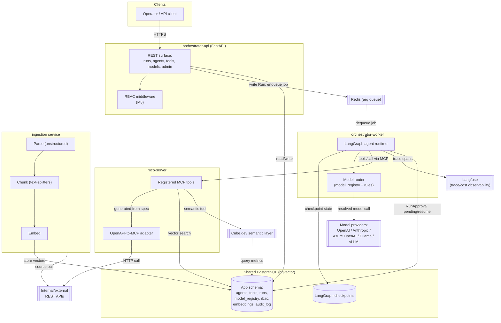

---

## 5. Milestone-by-Milestone Build-Out

Understanding *how* the system was built up, one working increment at a
time, is often more instructive than only seeing the final diagram above.
Each milestone is runnable and demoable on its own.

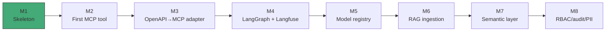

| Milestone | Adds | Status |
|---|---|---|
| **M1 — Skeleton** | Docker Compose stack; Postgres + `pgvector`; Alembic initial schema (all tables, even future-milestone ones); empty `orchestrator-api` (`/healthz`) and `mcp-server` (no tools registered yet) | ✅ Done |
| **M2 — First real tools** | Manually-defined MCP tools across two domains — `get_weather` (`demo/mock_api`) and seven DevOps/code-review tools wrapping `demo/mock_devops_api` (`list_open_pull_requests`, `get_pr_diff`, `post_review_comment`, `get_test_run_status`, `create_branch`, `commit_file_change`, `open_pull_request`) — + `ToolSource`/`Tool` registration rows; API-key auth middleware in front of `mcp-server`; `audit_log` write on every tool call | ✅ Done |
| **M3 — OpenAPI-to-MCP adapter** | Given an OpenAPI spec URL, auto-generates MCP tool definitions — scales tool coverage without hand-writing wrappers per endpoint | ⬜ Planned |
| **M4 — Agent runtime** | `orchestrator-worker` comes online: LangGraph executes agents, calling MCP tools, off the Redis/`arq` queue; Postgres checkpointing for resumable state; Langfuse wired in for tracing | ⬜ Planned |
| **M5 — Model registry** | `model_providers`/`model_registry`/`model_routing_rules` populated and enforced; multi-provider routing goes live (OpenAI, Anthropic, Azure OpenAI, Ollama, vLLM) | ⬜ Planned |
| **M6 — RAG ingestion** | `ingestion` service: file/SQL/datalake sources parsed, chunked, embedded into `pgvector`; a retrieval MCP tool for agents to query it | ⬜ Planned |
| **M7 — Semantic layer** | Cube.dev definitions in `semantic-layer/cube`, exposed as a queryable metrics layer — including as an agent tool, so agents query defined metrics instead of writing raw SQL | ⬜ Planned |
| **M8 — Governance hardening** | RBAC enforcement (roles/permissions/API keys), `audit_log` writes on mutating actions, PII detection/masking (`pii_findings`, `Tool.pii_policy`) enforced at runtime | ⬜ Planned |

### M1 today (what's actually running)

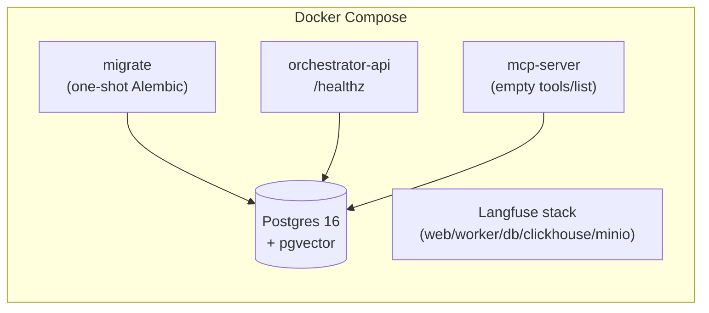

### M2 today (what's actually running)

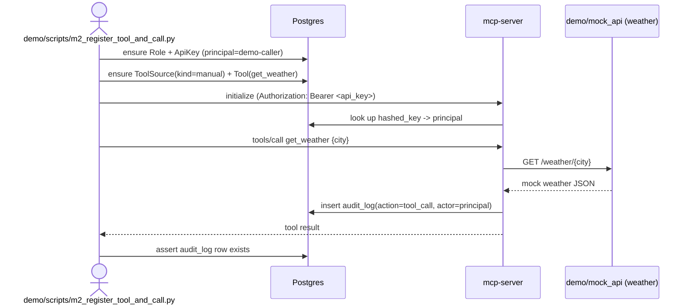

`ApiKeyAuthMiddleware` (`mcp_server/governance/auth.py`) is a plain ASGI
wrapper around `mcp.streamable_http_app()` — deliberately not using
Starlette's `add_middleware()` registration, so it doesn't depend on
FastMCP's internal middleware-building order. The resolved principal is
threaded through to the tool implementation via a `contextvars.ContextVar`
rather than a framework-specific request-context object, since the MCP
Python SDK doesn't (yet, as of the version this targets) expose one to tool
functions directly.

The DevOps/code-review domain (`demo/mock_devops_api`,
`mcp_server/tools/devops.py`, `demo/scripts/m2_devops_tools_and_call.py`)
follows the exact same shape as the diagram above — seven tools instead of
one, same auth/audit path — so it isn't re-diagrammed separately. It exists
alongside the weather tool (not replacing it) because it previews a real
DevOpsForge use case (PR review, test status, and now git-write actions)
while weather stays as the minimal reference example. Three tools —
`post_review_comment`, `commit_file_change`, `open_pull_request` — are
registered with `Tool.requires_approval = true` since they're write actions;
this doesn't gate anything yet (HITL enforcement is M8) but demonstrates the
registry already distinguishing read vs. write tools from M2 onward.

**Why `create_branch`, `commit_file_change`, and `open_pull_request` exist
already, even though there's no agent yet to drive them:** an "auto-fix a
failing test and open a PR" workflow splits into two concerns — *deciding*
what fix to make (reading a diff/test failure, reasoning about a patch) and
*executing* the mechanical git actions to get that fix in front of a human
reviewer. The first is an agent decision loop (LangGraph, M4+); the second is
just more deterministic API calls, no different in kind from `get_pr_diff`.
Building the mechanical tools now means M4's agent has something real to
call the moment it exists, instead of M4 also having to invent this API
surface. It also deliberately does **not** shortcut the reasoning half — no
LLM call is hidden inside these tools — because that would bypass Langfuse
tracing, the model registry, and the M8 HITL gate that `commit_file_change`/
`open_pull_request` are already flagged for.

---

## 6. Data Model

The schema is defined once in `packages/shared`, migrated by Alembic, and
shared read/write by `orchestrator-api`, `orchestrator-worker`, and
`ingestion`. It's grouped here by domain, matching the milestones that
populate/enforce each group.

### 6.1 Agents & Tools (M1–M3)

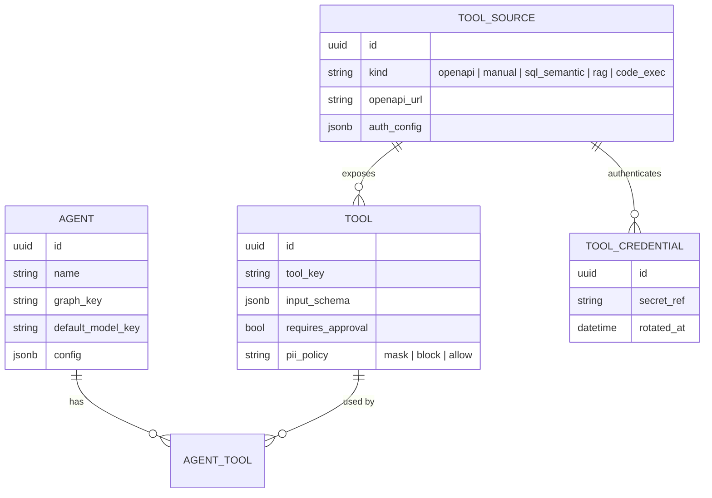

### 6.2 Model Registry (M5)

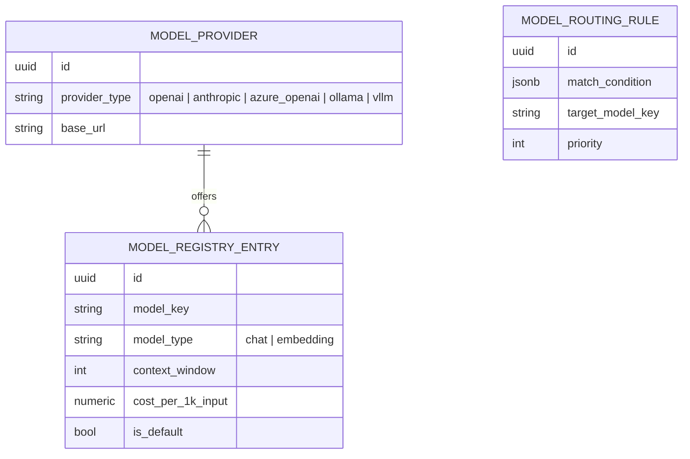

### 6.3 Runs & Human-in-the-Loop (M4)

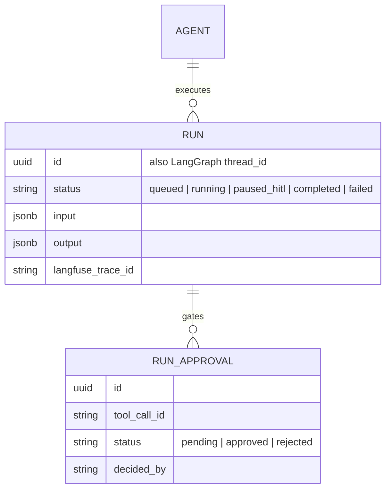

### 6.4 Ingestion & RAG (M6)

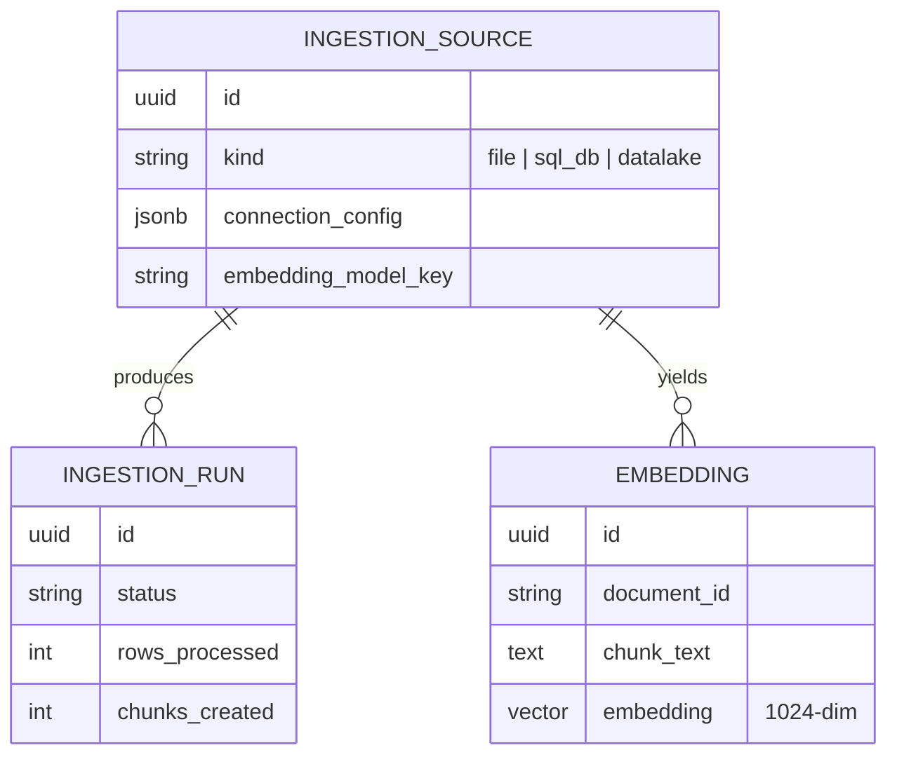

### 6.5 RBAC & Governance (M8)

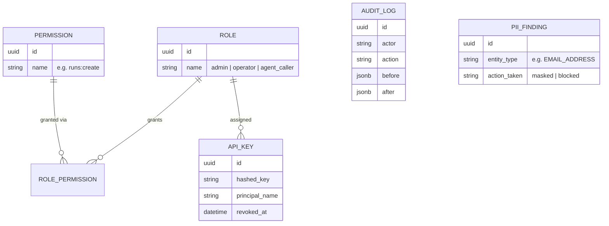

---

## 7. Key Runtime Flows

### 7.1 Agent run lifecycle (with HITL pause), from M4 onward

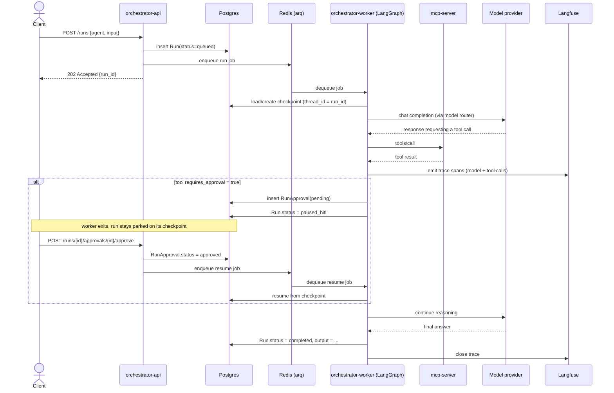

### 7.2 Turning an OpenAPI spec into MCP tools (M3)

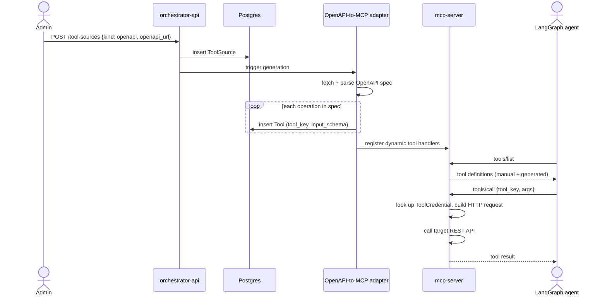

### 7.3 RAG ingestion and retrieval (M6)

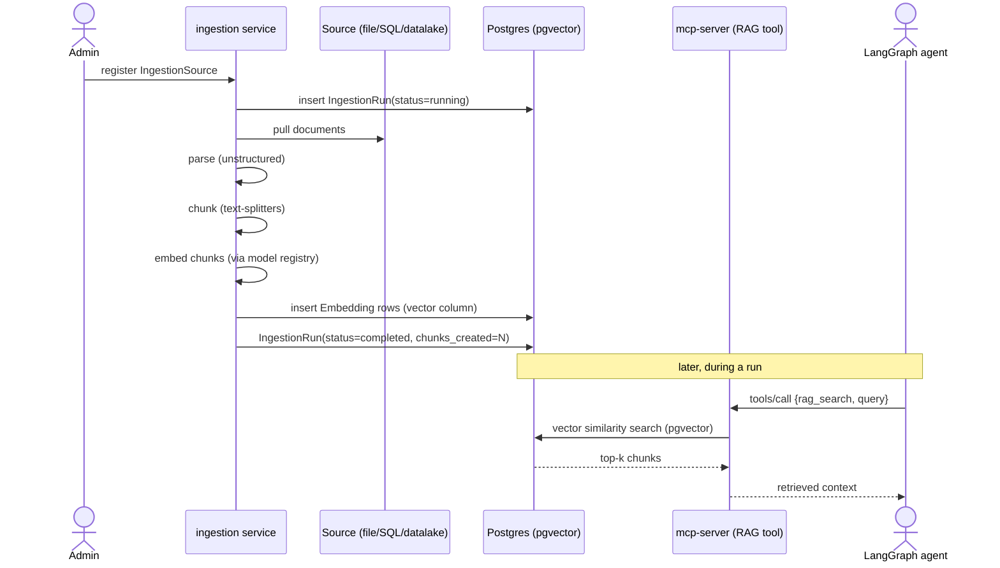

---

## 8. Deployment Topology

### 8.1 Today: local Docker Compose

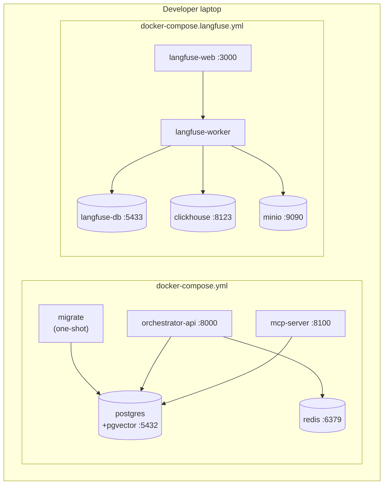

Brought up together with one command (`make up`), which composes both files
so the app stack and the Langfuse stack run side by side without port or
volume collisions (separate Postgres instances, separate port ranges).

### 8.2 Later: target cloud topology (not yet implemented)

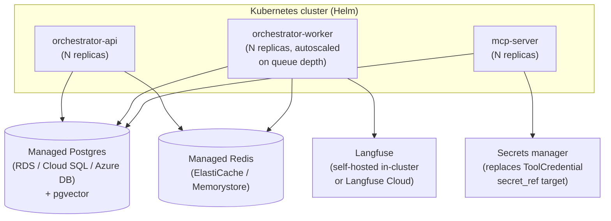

**Why this transition is low-risk:** application code already reads all
connection info from environment variables (`DATABASE_URL`,
`MCP_SERVER_PORT`, etc.) — see [2.10](#210-deployment-local-docker-compose-now-cloud-later-same-code).
Moving from Compose to Helm changes *how* those env vars are supplied and
*how* containers are scheduled, not the containers themselves.

---

## 9. Security & Governance Model (M8)

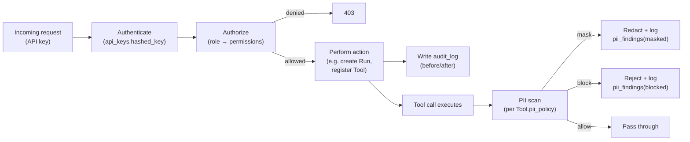

Even though enforcement lands at M8, every table this flow depends on
(`api_keys`, `roles`, `permissions`, `role_permissions`, `audit_log`,
`pii_findings`, `Tool.pii_policy`) exists from M1 — see
[2.8](#28-governance-designed-into-the-schema-from-day-one-enforced-later).

---

## Glossary

| Term | Meaning |
|---|---|
| **Agent** | An LLM-driven program that can reason over multiple steps and call tools, defined by a `graph_key` (which LangGraph graph to run) and a default model |
| **MCP (Model Context Protocol)** | An open standard for exposing "tools" (callable actions) to LLM-driven clients over a consistent transport, independent of any one model or agent framework |
| **LangGraph** | A framework for building agents as state machines ("graphs") with built-in support for pausing, resuming, and checkpointing execution state |
| **Checkpointer** | The mechanism LangGraph uses to persist an agent's mid-execution state so a run can be paused (e.g. for HITL approval) and resumed later from exactly where it left off |
| **HITL (Human-in-the-loop)** | A workflow pattern where certain agent actions require explicit human approval before proceeding |
| **RAG (Retrieval-Augmented Generation)** | Improving an LLM's answers by first retrieving relevant chunks of text (via vector similarity search) and including them in the prompt |
| **pgvector** | A PostgreSQL extension adding a vector column type and similarity-search operators, used here for RAG retrieval |
| **Langfuse** | An open-source LLM observability platform — traces model calls, tool calls, latency, token usage, and cost |
| **Cube.dev** | A semantic layer tool: define business metrics once (e.g. "monthly active users"), query them consistently from SQL, REST, or an agent tool |
| **arq** | A lightweight async job queue for Python, backed by Redis — used to run agent jobs off the request/response cycle |
| **RBAC (Role-Based Access Control)** | Restricting actions based on the role assigned to the calling principal (API key), rather than per-user special-casing |
| **Model registry** | The `model_providers`/`model_registry`/`model_routing_rules` tables that let AgenticForge resolve a logical model name to an actual provider/model at call time |
