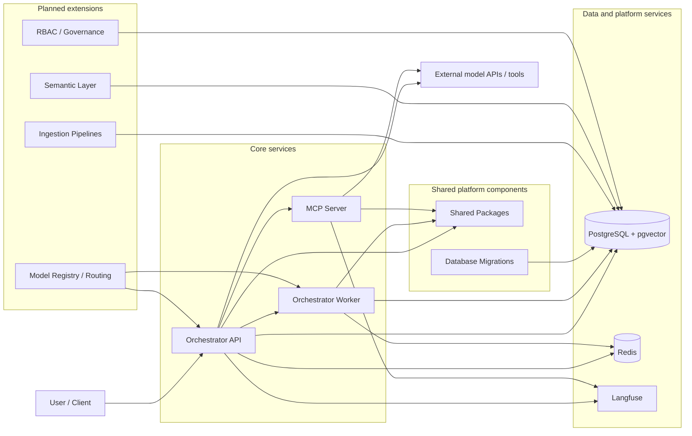

# Project Block Diagram

This diagram shows the high-level architecture for AgenticForge, including the current Phase 1 services and the future extensions planned in the repository.

## Component summary

- Orchestrator API: FastAPI entry point for orchestration requests and health checks.
- Orchestrator Worker: LangGraph-based execution engine for asynchronous workflow runs.
- MCP Server: Streamable HTTP server exposing tool integrations and adapters.
- Shared Packages: SQLAlchemy models, RBAC helpers, schema definitions, and shared utilities.
- PostgreSQL + Redis + Langfuse: core runtime and observability dependencies.
- Ingestion Pipelines, Semantic Layer, RBAC/Governance, and Model Registry: planned expansion areas.
